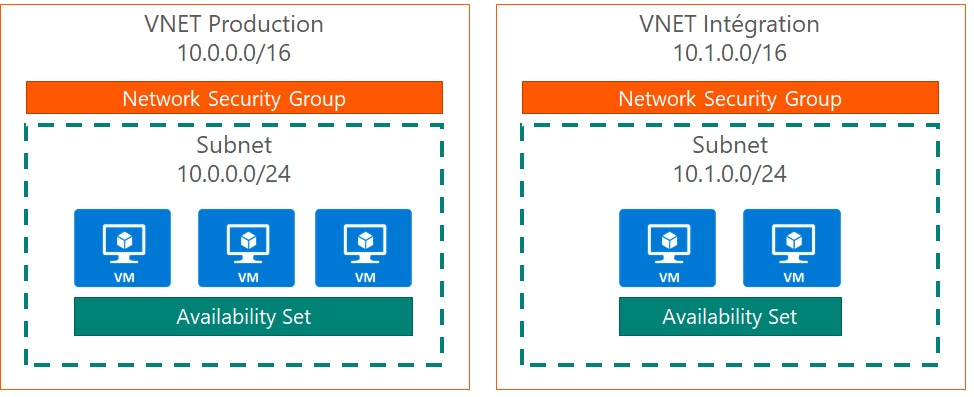

# Coding DevOps Terraform

<!-- toc -->

- [Coding DevOps Terraform](#coding-devops-terraform)
  - [Prerequisites](#prerequisites)
  - [Installation of Terraform](#installation-of-terraform)
    - [Manual Installation](#manual-installation)
    - [Installation via Chocolatey](#installation-via-chocolatey)
  - [Exercise 1 : Initialisation of Terraform and creation of a Resource Group](#exercise-1--initialisation-of-terraform-and-creation-of-a-resource-group)
  - [Exercise 2 : Creation of a Virtual Network](#exercise-2--creation-of-a-virtual-network)
  - [Exercise 3 : Utilisation of variables](#exercise-3--utilisation-of-variables)
  - [Exercise 4 : Creation of workspaces (environnements)](#exercise-4--creation-of-workspaces-environnements)
  - [Exercise 5 : Construction of a small infra](#exercise-5--construction-of-a-small-infra)
  - [Exercise 6 : Work in a team for a project (remote tfstate)](#exercise-6--work-in-a-team-for-a-project-remote-tfstate)

<!-- tocstop -->

## Prerequisites

- An active Azure subscription (where you are an Admin)
- Visual Studio Code
  - Terraform extension : https://marketplace.visualstudio.com/items?itemName=mauve.terraform
  - Terraform snipets extension : https://marketplace.visualstudio.com/items?itemName=mindginative.terraform-snippets
- Azure CLI : https://docs.microsoft.com/en-us/cli/azure/install-azure-cli-windows?view=azure-cli-latest
- Git (optional) : https://git-scm.com/download/win
- Terraform documentation for Azure : https://www.terraform.io/docs/providers/azurerm/

## Installation of Terraform

You can install Terraform in two ways:

### Manual Installation

- Download the binary package from the Terraform website: https://www.terraform.io/downloads.html
- Update the PATH to make Terraform binary accessible: https://stackoverflow.com/questions/1618280/where-can-i-set-path-to-make-exe-on-windows

### Installation via Chocolatey

Chocolatey is a Windows package manager. It also allows you to install Terraform. The only difference between using Chocolatey and manual installation is that the former will automatically add Terraform to the PATH. It also makes it easy to update.

If you do not have Chocolatey on your machine, you can install it via PowerShell commandline : https://chocolatey.org/install#install-with-powershellexe

```powershell
Set-ExecutionPolicy Bypass -Scope Process -Force; iex ((New-Object System.Net.WebClient).DownloadString('https://chocolatey.org/install.ps1'))
```

You can then install Terraform

```bash
choco install terraform
```

## Exercise 1 : Initialisation of Terraform and creation of a Resource Group

A Terraform project consists of an ensemble of `*.tf` files. The Terraform files are written using HCL (HashiCorp Configuration Language). 
Create your first `main.tf` file inside an empty directory.

```bash
provider "azurerm" { }

# Snippet tf-azurerm_resource_group
resource "azurerm_resource_group" "rg_coding_devops" {
  name     = "rg_coding_devops"
  location = "West Europe"
}
```

* The first line indicates which provider Terraform will use
* The second line creates a Resource Group named `rg_coding_devops`.

In a terminal, navigate to the directory where you created the file. The first step is to initialise the Terraform project. For this to happen, simply use the command :

```bash
terraform init
```

Terraform will download the latest version available for the Azure provider and will create a `.terraform` directory where the artifacts necessary for Terraform operation will be stored. This folder must be in `.gitignore` if you put your sources on Git.

Authenticate under your Azure subscription while using Azure CLI (the commands below will not work if you try authenticating using PowerShell commands)

```bash
az login

# If you have multiple subscriptions associated with your account, you can select one in particular
az account set --subscription <subscription_id>
```

> There are several ways to authenticate to Azure to make Terraform work. The one used now is the fastest way, but in real life you will most likely use an App declared in Azure AD (a Service Principal).

After being identified on Azure, type the command :

```bash
terraform plan
```

This command will not do anything in Azure, but will indicate an output of the operations that will be carried out. It's a kind of dry run. You should see that a resource group will be created, and no resources will be updated or destroyed.

To start the operation, type the command : 

```bash
terraform apply

# Type yes for confirmation
```

With the `az group list` command, or directly from the Azure portal, you will now see the resource gorup `rg_coding_devops`.

A `terraform.tfstate` file has been created at the root of the directory. It contains the state of the infrastructure deployed by your Terraform project. Again, do not put this file in your Source Control. We will cover this aspect in a later chapter of this course.

## Exercise 2 : Creation of a Virtual Network

We will now add a Virtual Network and a Subnet in our resource group. To do this, create a second file called `vnet.tf` and add both resources:

```bash
# Snippet : tf-azurerm_virtual_network
resource "azurerm_virtual_network" "vnet_coding_devops" {
  name                = "vnet_coding_devops"
  location            = "West Europe"
  resource_group_name = "${azurerm_resource_group.rg_coding_devops.name}"
  address_space       = ["10.0.0.0/16"]
  dns_servers         = ["10.0.0.4"]
}

# Snippet : tf-azurerm_subnet
resource "azurerm_subnet" "subnet_coding_devops" {
  name                 = "subnet_coding_devops"
  resource_group_name  = "${azurerm_resource_group.rg_coding_devops.name}"
  virtual_network_name = "${azurerm_virtual_network.vnet_coding_devops.name}"
  address_prefix       = "10.0.1.0/24"
}
```

Execute the command `terraform plan`

Since the resource group is already created, Terraform only indicates two resources to create. Do a `terraform apply` to create the resources.
To destroy the resources, use `terraform destroy`.

## Exercise 3 : Utilisation of variables

The goal here is to add a network card on the previous subnet, and to centralize our variables in an external `.tfvars` file.
For the sake of organization, we will create a `variables.tf` file that will contain all the variables shared by our different `.tf` files. For example, the `location` variable that is used in all resources.

All the local variables of `.tf` file will be declared in this particular file.

Pour chaque variable déclarée, mettre en valeur par défaut la valeur actuelle utilisée dans notre projet.
For each variable declared, highlight a default value to be used in our current project.

Progress of the exercise :

- Add a `nic.tf` file and set a network interface using the `tf-azurerm_network_interface` snippet;
- Add a `variables.tf` file and set a `location` variable with a default value of `West Europe`; 
- In each of the `.tf` files already created (main, nic, vnet), replace the hardcoded values using variables;
- Create a `production.tfvars` file which will contain the set of the variables' values, in the following format :

```bash
var_01 = "value01"

var_02 = "value02"

var_03 = "value03"
```

Execute the commands :

```bash
terraform plan --var-file="production.tfvars"
terraform apply --var-file="production.tfvars"
```

Once you've validated the resources' deployment, perform a `terraform destroy` operation.

## Exercise 4 : Creation of workspaces (environnements)

Workspaces make it possible to manage several environments. Each workspace has a dedicated `.tfstate` file.
The goal of the exercise is to have two workspaces: **Production** and **Stage** each using a separate configuration file.

- Create a `stage.tfvars` file and copy/paste the variables under the `production.tfvars` file -> adjust the naming convention accordingly;
- Create 2 (two) workspace by using the following command: `terraform workspace new <workspace_name>`;
- Deploy the environments on each of these two workspaces.

In order to switch between these two environments, you can use the following command: `terraform workspace select <workspace_name>`

To see a list of all the workspaces and the active workspace, you can use: `terraform workspace list`

## Exercise 5 : Construction of a small infra

Okay, so... You reached this far. By now, you've earned the status of a Dojo by order of the Peaky DevOps Blinders.  
The goal is to complete the previous exercises by building the following infrastructure:



The Virtual Machines will have the following charcteristics :

| Property | Value |
| --- | --- |
| vm_size | "Standard_D2s_v3" (allows to have Premium disks) |
| OS publisher | "Canonical" |
| OS offer | "UbuntuServer"|
| OS sku | "14.04.2-LTS" |
| OS version | latest |
|managed_disk_type |"Premium_LRS" |

The only requirement here is that one or more VMs must be easily added to the production environment, at any given time.
As a recommendation, create the following files :

- `disk.tf`
  - Contains the Data Disk therefrom VM (ressource `azurerm_managed_disk`). Refer to the Terraform documentation, no snippet for this resource.

```bash
resource "azurerm_managed_disk" "datadisk_coding_dojo" {
  name = "datadisk"
  location = "${var.location}"
  resource_group_name = "${azurerm_resource_group.rg_coding_dojo.name}"
  storage_account_type = "Standard_LRS"
  create_option = "Empty"
  disk_size_gb = "1024"
}
```

- `availability_set.tf`
  - The availability set must also be managed to support VMs with managed disks. Add a property of `managed = "true"`
- `nsg.tf`
  - Network security group for the subnet
- `vm.tf`
  - You will need an OS Disk and a Data Disk (the one you previously created under the `disk.tf` file)

```bash
  storage_os_disk {
    name              = "${var.vm_coding_dojo_name}_osdisk"
    managed_disk_type = "Premium_LRS"
    caching           = "ReadWrite"
    create_option     = "FromImage"
  }

  storage_data_disk {
    name              = "${var.vm_coding_dojo_name}_datadisk"
    managed_disk_id   = "${azurerm_managed_disk.datadisk_coding_dojo.id}"
    managed_disk_type = "Premium_LRS"
    disk_size_gb      = "1024"
    create_option     = "Attach"
    lun               = 0
  }
```

The first is created directly, while the second is a reference to the already created disk. Be careful, the properties that define the size and disk name must be the same in the `disk.tf` and `vm.tf` file.

Some observations to keep in mind when adjusting the resources:
- The hostname must be written with alphanumeric characters;
- The login of the VM must not be 'admin' (there is a list of prohibited login names);
- The password of the VM must be at least 12 characters with (probably) special characters.

To create multiple VMs, you can use the `count` property. We have therefore several solutions:

- The VMs are on static IP
  - We then declare the list of IPs in the variable file, and we give as value to `count` the size of the array that lists these IPs (function `length`).
- Let the VMs be in Dynamic IP
  - In the variable file, we add a property that is simply the number of machines.

## Exercise 6 : Work in a team for a project (remote tfstate)

So far, the `.tfstate` file recording the state of the platform is stored locally. That becomes a problem when a team, or multiple people work on the infrastructure.

Terraform allows you to store the `.tfstate` in remote location, so that you can share it with the rest of the team, and everyone can lock it when you change the infrastructure.

On Azure, Terraform supports storing it in a `Storage Account> Blob> Container`.

